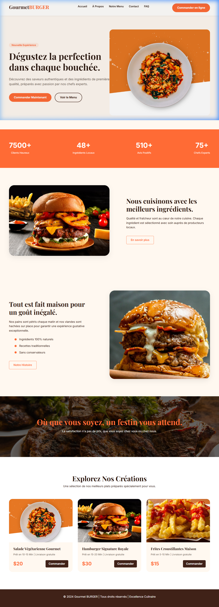

# 🍔 Gourmet BURGER | L'excellence Culinaire



Un site web moderne et élégant pour un restaurant de burgers haut de gamme. Ce projet a été conçu pour offrir une expérience utilisateur fluide et immersive, mettant en valeur des créations culinaires d'exception.

## ✨ Caractéristiques

- **Design Premium** : Une esthétique soignée avec une palette de couleurs chaleureuses et professionnelles.
- **Réactivité Totale** : Entièrement compatible avec les mobiles, tablettes et ordinateurs de bureau.
- **Interface Moderne** : Navigation avec effet "Glassmorphism" et animations fluides.
- **Typographie Élégante** : Utilisation de Google Fonts (*Playfair Display* & *Inter*) pour une lisibilité optimale.
- **Performance Optimisée** : Structure légère et chargement rapide.

## 🛠️ Technologies Utilisées

- **HTML5** : Structure sémantique et optimisée pour le SEO.
- **CSS3** : Design personnalisé avec variables CSS et Grid/Flexbox.
- **Bootstrap** : Utilisation de la grille pour une mise en page robuste.
- **Google Fonts** : Intégration de polices modernes.

## 📁 Structure du Projet

```text
/
├── assets/
│   └── img/          # Images et ressources visuelles
├── css/
│   ├── bootstrap.css # Framework de base
│   └── style.css     # Styles personnalisés premium
├── index.html        # Page principale
└── README.md         # Documentation du projet
```

## 🚀 Installation

1. Clonez le dépôt :
   ```bash
   git clone https://github.com/charaf12-u/site-web-burger.git
   ```
2. Ouvrez `index.html` dans votre navigateur.

---
Conçu avec passion par **Gourmet BURGER**.
